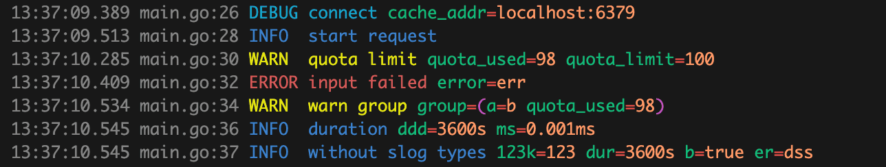

[](https://pkg.go.dev/github.com/khv1one/beautyslog)
[](https://goreportcard.com/report/github.com/khv1one/beautyslog)
[](https://github.com/khv1one/beautyslog/actions)
[](LICENSE)


---

> **A fast & beautiful `slog.Handler` for modern Go terminals**

A fast and colorful `slog.Handler` implementation for human‑friendly terminal logs.

`beautyslog` formats log entries with colors, aligned levels, grouped attributes, and efficient buffer reuse.

It is **2x faster than the default `slog.TextHandler`** and performs **3x fewer allocations** (benchmarks below).

---



## 🚀 Features

* Pretty, colorized terminal logs
* Fast and allocation‑efficient (`sync.Pool` for buffers)
* Fully compatible with `log/slog`
* Supports groups, attributes, `ReplaceAttr`, `AddSource`
* Clean, aligned output
* Safe for concurrent use
* Works as a drop‑in replacement for any slog handler

---

## 📦 Installation

```bash
go get github.com/khv1one/beautyslog
```

---

## 🧩 Usage Example

### Basic Setup

```go
logger := slog.New(beautyslog.New(os.Stdout, &slog.HandlerOptions{
    Level: slog.LevelDebug,
    AddSource: true,
}))

logger.Info("server started", "port", 8080)
logger.Debug("processing request", "id", 123)
```

### Using groups and attributes

```go
log := logger.With(
    slog.String("service", "billing"),
)

log.WithGroup("db").Info("query executed",
    "sql", "SELECT * FROM payments",
    "duration", 12*time.Millisecond,
)
```

### Using ReplaceAttr

```go
handler := beautyslog.New(os.Stdout, &slog.HandlerOptions{
    ReplaceAttr: func(groups []string, a slog.Attr) slog.Attr {
        if a.Key == slog.TimeKey {
            return slog.String(a.Key, time.Now().Format(time.DateTime))
        }
        return a
    },
})
```

---

## 🧪 Benchmarks

Measured on Apple M1 Pro:

```
BenchmarkSlogTextHandlerWithSource-8         909481         1299 ns/op        384 B/op      6 allocs/op
BenchmarkPrettyTextHandlerWithSource-8       2020834        595.0 ns/op       248 B/op      2 allocs/op
BenchmarkSlogTextHandlerWithoutSource-8      1370437        874.2 ns/op         3 B/op      1 allocs/op
BenchmarkPrettyTextHandlerWithoutSource-8    2736182        435.6 ns/op         0 B/op      0 allocs/op
```

**beautyslog is twice as fast and 3× more memory‑efficient.**

---

## 🔧 Best Practices

* Use `WithGroup` for struct‑like hierarchical logs
* Use `WithAttrs` for shared fields
* Prefer `ReplaceAttr` for transformations (timestamps, hiding fields)
* Keep attribute names short for cleaner output
* Avoid logging giant byte arrays; they render raw
