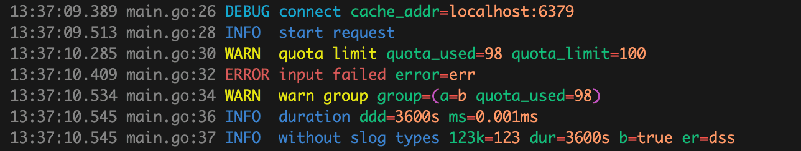

[](https://pkg.go.dev/github.com/khv1one/beautyslog)
[](https://goreportcard.com/report/github.com/khv1one/beautyslog)
[](https://github.com/khv1one/beautyslog/actions)
[](LICENSE)


---

> **A fast & beautiful `slog.Handler` for modern Go terminals**

A fast and colorful `slog.Handler` implementation for human‑friendly terminal logs.

`beautyslog` formats log entries with colors, aligned levels, grouped attributes, and efficient buffer reuse.

It is **2x faster than the default `slog.TextHandler`** and performs **3x fewer allocations** (benchmarks below).

---



## 🚀 Features

* Pretty, colorized terminal logs
* Fast and allocation‑efficient (`sync.Pool` for buffers)
* Fully compatible with `log/slog`
* Supports groups, attributes, `ReplaceAttr`, `AddSource`
* Customizable field order and color scheme
* Clean, aligned output
* Safe for concurrent use
* Works as a drop‑in replacement for any slog handler

---

## 📦 Installation

```bash
go get github.com/khv1one/beautyslog
```

---

## 🧩 Usage Example

### Basic Setup

```go
package main

import (
    "log/slog"
    "os"

    "github.com/khv1one/beautyslog"
)

func main() {
    handler := beautyslog.New(os.Stdout, &beautyslog.HandlerOptions{
        Level:     slog.LevelDebug,
        AddSource: true,
    })
    logger := slog.New(handler)

    logger.Info("server started", "port", 8080)
    logger.Debug("processing request", "id", 123)
}
```

### Using groups and attributes

```go
log := logger.With(
    slog.String("service", "billing"),
)

log.WithGroup("db").Info("query executed",
    "sql", "SELECT * FROM payments",
    "duration", 12*time.Millisecond,
)
```

### Using ReplaceAttr

```go
handler := beautyslog.New(os.Stdout, &beautyslog.HandlerOptions{
    ReplaceAttr: func(groups []string, a slog.Attr) slog.Attr {
        if a.Key == slog.TimeKey {
            return slog.String(a.Key, time.Now().Format(time.DateTime))
        }
        return a
    },
})
```

### Customizing field order

Control which fields appear and in what order using the `Fields` option.
Omitted fields are skipped without leaving extra spaces.

```go
handler := beautyslog.New(os.Stdout, &beautyslog.HandlerOptions{
    Fields: []beautyslog.Field{
        beautyslog.LevelField,
        beautyslog.MessageField,
        beautyslog.TimeField,
    },
})
```

Available fields: `TimeField`, `SourceField`, `LevelField`, `MessageField`, `AttrsField`.
When `Fields` is nil or empty, the default order `[Time, Source, Level, Message, Attrs]` is used.

### Customizing colors

Override any ANSI color via `ColorScheme`. Unset fields fall back to the built‑in defaults.

```go
handler := beautyslog.New(os.Stdout, &beautyslog.HandlerOptions{
    Colors: &beautyslog.ColorScheme{
        Time:  []byte("\033[96m"), // cyan
        Debug: []byte("\033[35m"), // magenta
        Info:  []byte("\033[32m"), // green
        Warn:  []byte("\033[33m"), // yellow
        Error: []byte("\033[31m"), // red
        Key:   []byte("\033[37m"), // white
        Value: []byte("\033[93m"), // bright yellow
        Group: []byte("\033[95m"), // bright magenta
    },
})
```

### Custom log levels

`beautyslog` handles custom `slog.Level` values gracefully. Unknown levels fall back to `Level.String()` and are rendered with the default color.

```go
var levelTrace = slog.Level(-8)
logger := slog.New(beautyslog.New(os.Stdout, &beautyslog.HandlerOptions{
    Level: levelTrace,
}))

logger.Log(context.Background(), levelTrace, "trace message")
```

---

## 🧪 Benchmarks

Measured on Apple M1 Pro:

```
BenchmarkSlogTextHandlerWithSource-8         909481         1299 ns/op        384 B/op      6 allocs/op
BenchmarkPrettyTextHandlerWithSource-8       2020834        595.0 ns/op       248 B/op      2 allocs/op
BenchmarkSlogTextHandlerWithoutSource-8      1370437        874.2 ns/op         3 B/op      1 allocs/op
BenchmarkPrettyTextHandlerWithoutSource-8    2736182        435.6 ns/op         0 B/op      0 allocs/op
```

**beautyslog is twice as fast and 3× more memory‑efficient.**

---

## 🔧 Best Practices

* Use `WithGroup` for struct‑like hierarchical logs
* Use `WithAttrs` for shared fields
* Prefer `ReplaceAttr` for transformations (timestamps, hiding fields)
* Keep attribute names short for cleaner output
* Avoid logging giant byte arrays; they render raw
